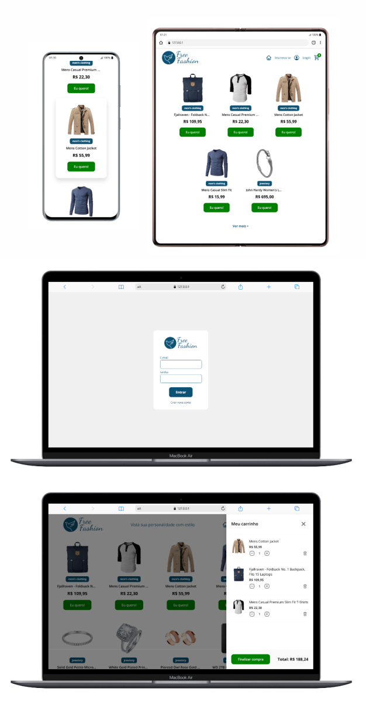

# ⚡ Projeto - Free-Fashion

## 🚀 Sobre o projeto

Bem-vindo ao **Free-Fashion**, uma loja virtual moderna desenvolvida com **HTML5, CSS3 e JavaScript Vanilla**.

O projeto foi criado com foco em boas práticas de desenvolvimento Front-end, priorizando **performance, acessibilidade, semântica, organização do código e componentização utilizando Web Components**.

A aplicação simula um e-commerce completo, permitindo visualizar produtos, adicionar itens ao carrinho, realizar cadastro e login de usuários utilizando **LocalStorage**, proporcionando uma experiência semelhante a uma loja virtual real sem necessidade de um back-end.

---

# 📋 Pré-requisitos

Antes de executar o projeto, certifique-se de possuir instalado:

- **Node.js**: https://nodejs.org/
- **npm** (instalado juntamente com o Node.js)
- **Live Preview - Microsoft** (extensão disponível nos plugins do Visual Studio Code)

---

# 🚀 Como executar o projeto

1. Clone o repositório

```bash
git clone <url-do-repositorio>
```

2. Acesse a pasta

```bash
cd Free-Fashion
```

## ▶️ Executando o projeto utilizando o Live Preview

### 1. Instalar a extensão

No Visual Studio Code:

1. Acesse **Extensions** (`Ctrl + Shift + X`).
2. Pesquise por:

```text
Live Preview
```

3. Instale:

```text
Live Preview - Microsoft
```

---

### 2. Abrir o projeto

Abra a pasta:

```text
Free-Fashion
```

no Visual Studio Code.

---

### 3. Executar o projeto

Abra o arquivo:

```text
index.html
```

Clique com o botão direito e selecione:

```text
Show Preview
```

ou:

```text
Open with Live Preview
```

O projeto será aberto em um servidor local.

Exemplo:

```text
http://127.0.0.1:3000/
```

---

### Observação

O projeto utiliza **JavaScript Modules**, **Web Components** e carregamento de arquivos externos, por isso deve ser executado através de um servidor local.

Não abra diretamente:

```text
file:///C:/Free-Fashion/index.html
```

pois alguns recursos podem ser bloqueados pelo navegador.

---

# 🛠 Tecnologias utilizadas

- HTML5
- CSS3
- JavaScript (ES6+)
- Web Components
- CSS Variables
- LocalStorage
- Fetch API
- Fake Store API

---

# ✨ Recursos utilizados

O projeto foi desenvolvido utilizando diversos recursos modernos da plataforma Web.

- HTML5 semântico
- CSS3
- CSS Variables
- Flexbox
- Grid Layout
- JavaScript Modular (ES Modules)
- Web Components
- Fetch API
- Custom Events
- LocalStorage
- Componentização
- Lazy Loading de imagens
- Responsividade
- Boas práticas de acessibilidade (ARIA)
- Organização baseada em arquitetura de componentes

---

# 🛍 Funcionalidades

- Catálogo de produtos
- Consumo de API
- Carrinho de compras
- Adição de produtos ao carrinho
- Remoção de produtos
- Atualização automática do carrinho
- Simulação de login
- Simulação de cadastro
- Persistência dos dados no LocalStorage
- Modal de mensagens
- Componentes reutilizáveis
- Interface responsiva
- Navegação otimizada

---

# 🔐 Autenticação

O projeto possui uma simulação completa de autenticação utilizando **LocalStorage**.

Recursos implementados:

- Cadastro de usuário
- Login
- Persistência da sessão
- Logout
- Verificação de usuário autenticado
- Validação de e-mail já cadastrado
- Validação de e-mail e senha

---

# 🛒 Carrinho

O carrinho foi desenvolvido utilizando LocalStorage para persistir os produtos.

Recursos:

- Adicionar produtos
- Remover produtos
- Atualizar quantidade
- Persistência entre recarregamentos da página

---

# 🌐 API

Os produtos são carregados dinamicamente através da:

https://fakestoreapi.com

Documentação:

https://fakestoreapi.com/docs

---

# ♿ Acessibilidade

O projeto foi desenvolvido seguindo boas práticas de acessibilidade.

Entre elas:

- HTML semântico
- Labels associadas aos inputs
- aria-label
- aria-live
- role="alert"
- Navegação por teclado
- Focus visível
- Imagens decorativas utilizando alt=""
- Lazy Loading

---

# 📱 Responsividade

O layout adapta-se para:

- Desktop
- Notebook
- Tablet
- Smartphone

---

# ⚙️ Organização do projeto

```
Free-Fashion
│
├── assets
│   │
│   ├── css
│   │   ├── base
│   │   ├── components
│   │   └── main.css
│   │
│   ├── docs
│   │   └── GUIDELINE.md
│   │
│   ├── images
│   │   ├── error
│   │   ├── favicon
│   │   ├── icons
│   │   └── logo
│   │
│   ├── js
│   │   │
│   │   ├── components
│   │   │   ├── pages-components
│   │   │   ├── cart-component.js
│   │   │   ├── grid-component.js
│   │   │   ├── header-component.js
│   │   │   ├── logo-component.js
│   │   │   ├── menu-component.js
│   │   │   ├── message-info-component.js
│   │   │   ├── modal-component.js
│   │   │   └── slogan-component.js
│   │   │
│   │   ├── services
│   │   │   ├── api.js
│   │   │   ├── authentication.js
│   │   │   └── cart-storage.js
│   │   │
│   │   ├── utils
│   │   │   └── constants.js
│   │   │
│   │   ├── views
│   │   │   ├── cart-view.js
│   │   │   └── products-view.js
│   │   │
│   │   └── main.js
│   │
│   └── pages
│       ├── login
│       │   └── login-page.html
│       │
│       └── register
│           ├── register-page.html
│           └── register-page.css
│
├── index.html
├── README.md
└── .gitignore
```

---

# 📁 Componentes

O projeto foi desenvolvido utilizando **Web Components**, promovendo reutilização e desacoplamento entre os elementos da interface.

Componentes disponíveis:

- Header
- Logo
- Menu
- Grid de Produtos
- Carrinho
- Modal
- Mensagens
- Slogan

---

# 🎨 Padrões utilizados

- Clean Code
- Componentização
- Separação de responsabilidades
- CSS organizado
- Código reutilizável
- ES Modules
- Boas práticas de acessibilidade
- HTML semântico

---

# 📄 Documentação

O projeto possui documentação complementar.

```
assets/docs/GUIDELINE.md
```

---

# 🚫 .gitignore

O projeto possui arquivo `.gitignore` para evitar o versionamento de arquivos desnecessários.

Exemplo:

```gitignore
node_modules/
.vscode/
dist/
.DS_Store
```

---

# ✨ Demonstração



---

# 👨‍💻 Autor

Projeto desenvolvido para fins de estudo e aprimoramento das habilidades em desenvolvimento Front-end utilizando **HTML5**, **CSS3** e **JavaScript Vanilla**, aplicando conceitos modernos de componentização, responsividade, acessibilidade e boas práticas de desenvolvimento.
